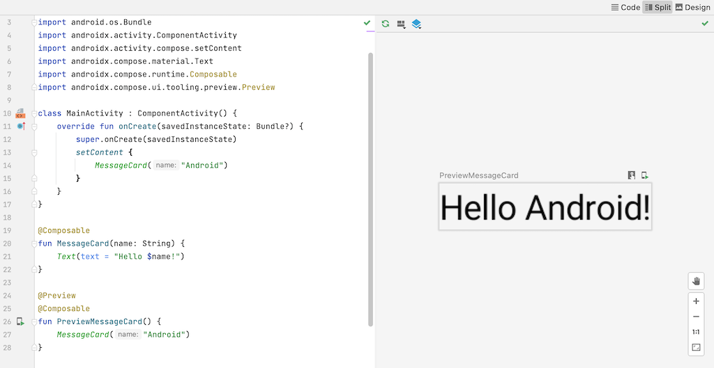
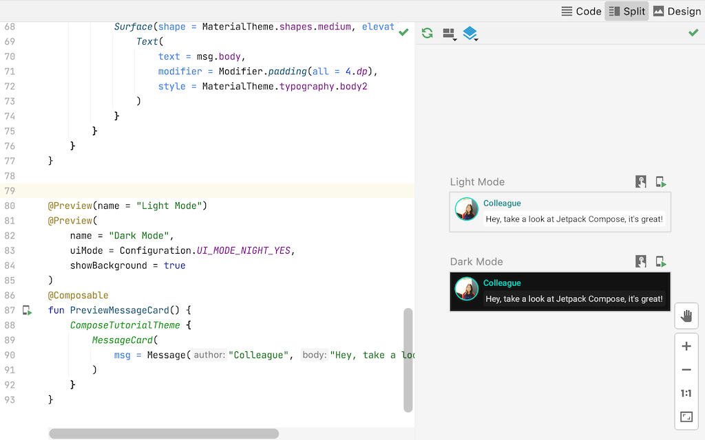

# Android_Jetpack_Compose_Tutorial
=====================

Ref: 
<https://github.com/android/compose-samples>
<https://developer.android.com/jetpack/compose/tutorial>

- [Android\_Jetpack\_Compose\_Tutorial](#android_jetpack_compose_tutorial)
  - [TUTORIAL](#tutorial)
    - [Jetpack Compose Tutorial](#jetpack-compose-tutorial)
    - [Lesson 1: Composable functions](#lesson-1-composable-functions)
      - [Add a text element](#add-a-text-element)
      - [Define a composable function](#define-a-composable-function)
      - [Preview your function in Android Studio](#preview-your-function-in-android-studio)
    - [Lesson 2: Layouts](#lesson-2-layouts)
      - [Add multiple texts](#add-multiple-texts)
      - [Using a Column](#using-a-column)
      - [Add an image element](#add-an-image-element)
      - [Configure your layout](#configure-your-layout)
    - [Lesson 3: Material Design](#lesson-3-material-design)
      - [Use Material Design](#use-material-design)
      - [Color](#color)
      - [Typography](#typography)
      - [Shape](#shape)
      - [Enable dark theme](#enable-dark-theme)
    - [Lesson 4: Lists and animations](#lesson-4-lists-and-animations)
      - [Create a list of messages](#create-a-list-of-messages)
      - [Animate messages while expanding](#animate-messages-while-expanding)
  - [Comparison between Android Compose and iOS SwiftUI](#comparison-between-android-compose-and-ios-swiftui)

## TUTORIAL
### Jetpack Compose Tutorial

Jetpack Compose is a modern toolkit for building native Android UI. Jetpack Compose simplifies and accelerates UI development on Android with less code, powerful tools, and intuitive Kotlin APIs.

In this tutorial, you'll build a simple UI component with declarative functions. You won't be editing any XML layouts or using the Layout Editor. Instead, you will call composable functions to define what elements you want, and the Compose compiler will do the rest.

### Lesson 1: Composable functions
Jetpack Compose is built around composable functions. These functions let you define your app's UI programmatically by describing how it should look and providing data dependencies, rather than focusing on the process of the UI's construction (initializing an element, attaching it to a parent, etc.). To create a composable function, just add the @Composable annotation to the function name.

#### Add a text element
To begin, download the most recent version of Android Studio, and create an app by selecting New Project, and under the Phone and Tablet category, select Empty Compose Activity. Name your app ComposeTutorial and click Finish. The default template already contains some Compose elements, but in this tutorial you will build it up step by step.

First, display a “Hello world!” text by adding a text element inside the onCreate method. You do this by defining a content block, and calling the Text composable function. The setContent block defines the activity's layout where composable functions are called. Composable functions can only be called from other composable functions.

Jetpack Compose uses a Kotlin compiler plugin to transform these composable functions into the app's UI elements. For example, the Text composable function that is defined by the Compose UI library displays a text label on the screen.

#### Define a composable function
To make a function composable, add the @Composable annotation. To try this out, define a MessageCard function which is passed a name, and uses it to configure the text element.

#### Preview your function in Android Studio
The @Preview annotation lets you preview your composable functions within Android Studio without having to build and install the app to an Android device or emulator. The annotation must be used on a composable function that does not take in parameters. For this reason, you can't preview the MessageCard function directly. Instead, make a second function named PreviewMessageCard, which calls MessageCard with an appropriate parameter. Add the @Preview annotation before @Composable.

Rebuild your project. The app itself doesn't change, since the new PreviewMessageCard function isn't called anywhere, but Android Studio adds a preview window which you can expand by clicking on the split (design/code) view. This window shows a preview of the UI elements created by composable functions marked with the @Preview annotation. To update the previews at any time, click the refresh button at the top of the preview window.

### Lesson 2: Layouts
UI elements are hierarchical, with elements contained in other elements. In Compose, you build a UI hierarchy by calling composable functions from other composable functions.

#### Add multiple texts
So far you’ve built your first composable function and preview! To discover more Jetpack Compose capabilities, you’re going to build a simple messaging screen containing a list of messages that can be expanded with some animations.

Start by making the message composable richer by displaying the name of its author and a message content. You need to first change the composable parameter to accept a Message object instead of a String, and add another Text composable inside the MessageCard composable. Make sure to update the preview as well.

---
This code creates two text elements inside the content view. However, since you haven't provided any information about how to arrange them, the text elements are drawn on top of each other, making the text unreadable.

#### Using a Column
The Column function lets you arrange elements vertically. Add Column to the MessageCard function.
You can use Row to arrange items horizontally and Box to stack elements.

#### Add an image element
Enrich your message card by adding a profile picture of the sender. Use the Resource Manager to import an image from your photo library or use this one. Add a Row composable to have a well structured design and an Image composable inside it.

#### Configure your layout
Your message layout has the right structure but its elements aren't well spaced and the image is too big! To decorate or configure a composable, Compose uses modifiers. They allow you to change the composable's size, layout, appearance or add high-level interactions, such as making an element clickable. You can chain them to create richer composables. You'll use some of them to improve the layout.

### Lesson 3: Material Design
Compose is built to support Material Design principles. Many of its UI elements implement Material Design out of the box. In this lesson, you'll style your app with Material Design widgets.

#### Use Material Design
Your message design now has a layout, but it doesn't look too good yet.

Jetpack Compose provides an implementation of Material Design and its UI elements out of the box. You'll improve the appearance of our MessageCard composable using Material Design styling.

To start, wrap the MessageCard function with the Material theme created in your project, ComposeTutorialTheme, as well as a Surface. Do it both in the @Preview and in the setContent function. Doing so will allow your composables to inherit styles as defined in your app's theme ensuring consistency across your app.

Material Design is built around three pillars: Color, Typography, and Shape. You will add them one by one.

#### Color
Use MaterialTheme.colors to style with colors from the wrapped theme. You can use these values from the theme anywhere a color is needed.

Style the title and add a border to the image.

#### Typography
Material Typography styles are available in the MaterialTheme, just add them to the Text composables.

#### Shape
With Shapeyou can add the final touches. First, wrap the message body text around a Surface composable. Doing so allows customizing the message body's shape and elevation. Padding is also added to the message for a better layout.

#### Enable dark theme
Dark theme (or night mode) can be enabled to avoid a bright display especially at night, or simply to save the device battery. Thanks to the Material Design support, Jetpack Compose can handle the dark theme by default. Having used Material Design colors, text and backgrounds will automatically adapt to the dark background.

You can create multiple previews in your file as separate functions, or add multiple annotations to the same function.

Add a new preview annotation and enable night mode.

---

Color choices for the light and dark themes are defined in the IDE-generated Theme.kt file.

So far, you've created a message UI element that displays an image and two texts with different styles, and it looks good both in light and dark themes!

### Lesson 4: Lists and animations
Lists and animations are everywhere in apps. In this lesson, you will learn how Compose makes it easy to create lists and fun to add animations.

#### Create a list of messages
A chat with one message feels a bit lonely, so change your conversation to have more than one message. You'll need to create a Conversation function that will show multiple messages. For this use case, use Compose’s LazyColumn and LazyRow. These composables render only the elements that are visible on screen, so they are designed to be very efficient for long lists.

In this code snippet, you can see that LazyColumn has an items child. It takes a List as a parameter and its lambda receives a parameter we’ve named message (we could have named it whatever we want) which is an instance of Message. In short, this lambda is called for each item of the provided List. Import this sample dataset into your project to help bootstrap the conversation quickly.

#### Animate messages while expanding
The conversation is getting more interesting. It's time to play with animations! You will add the ability to expand a message to show a longer one, animating both the content size and the background color. To store this local UI state, you need to keep track of whether a message has been expanded or not. To keep track of this state change, you have to use the functions remember and mutableStateOf.

Composable functions can store local state in memory by using remember, and track changes to the value passed to mutableStateOf. Composables (and their children) using this state will get redrawn automatically when the value is updated. This is called recomposition.

By using Compose’s state APIs like remember and mutableStateOf, any changes to state automatically update the UI.

---
Now you can change the background of the message content based on isExpanded when we click on a message. You will use the clickable modifier to handle click events on the composable. Instead of just toggling the background color of the Surface, you will animate the background color by gradually modifying its value from MaterialTheme.colors.surface to MaterialTheme.colors.primary and vice versa. To do so, you will use the animateColorAsState function. Lastly, you will use the animateContentSize modifier to animate the message container size smoothly:

## Comparison between Android Compose and iOS SwiftUI

